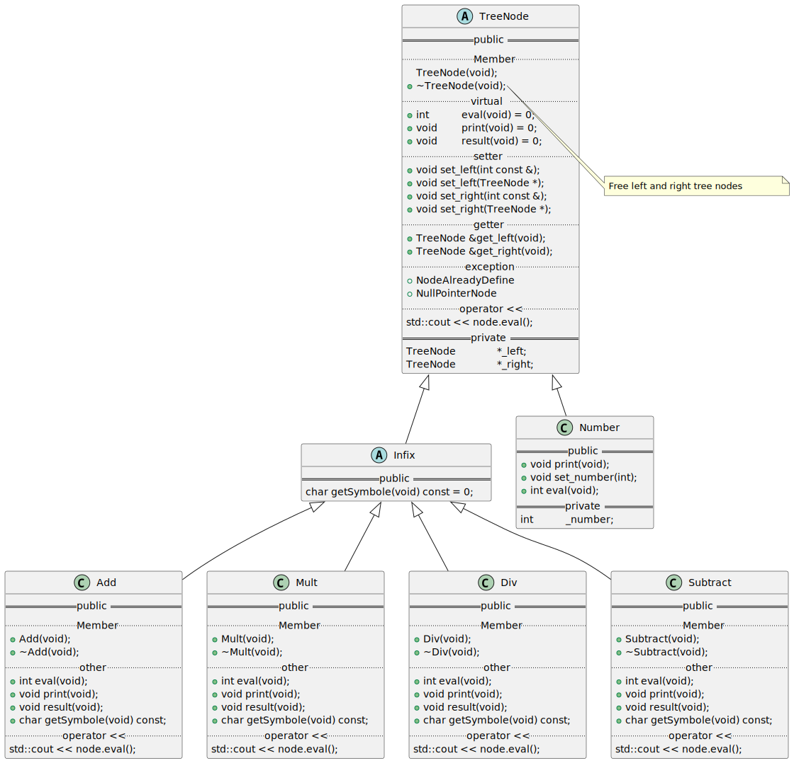
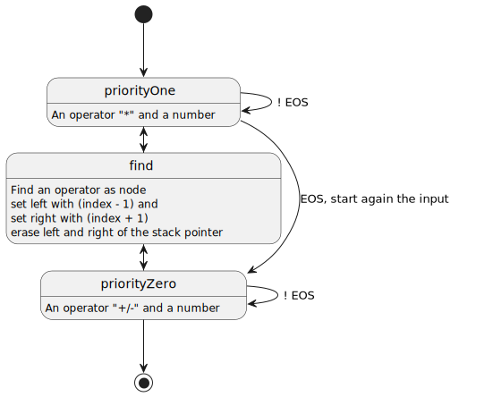

= Parsing math expression
:favicon: assets/favicon.png
:nofooter:
:sectnums:
:toc: left
:stylesheet: assets/my-stylesheet.css
:stem:

== Examples input

* Precedence
+
[cols="1,1,1"]
|===
|Input |Correct |Error

|stem:[x + 5 * y]
|stem:[x + (5 * y)]
|stem:[(x + 5) * y]
|===

* Associativity
+
[cols="1,1,1"]
|===
|Input |Correct |Error

|stem:[7 - 3 + 2]
|stem:[(7 - 3) + 2]
|stem:[7 - (3 + 2)]
|===

== Grammar for expressions

E:: Expression
T:: Term
F:: Factor

=== Variations

* stem:[E -> T + E | T - E | T]
* stem:[T -> F * T | F / T | F]
* stem:[F -> ID | "Integers" | (E) - F]

=== Tokens

* ID
+
image::assets/token_id.svg[Token: ID]

* integer
+

=== Lexical analysis

code:: function `scanToken()`
+
Scans the input and sets nextToken to point to the newly scanned token.
variable:: nextToken

OOP:: Object-Oriented Programming

=== Tree

Tree example with: stem:[-(x + 5) * 2]

image::assets/tree_example.svg[tree example]

The superclass `tree node`:

Infix operators:

image:assets/class_subtract.svg[Class: subtract]

Prefix unary operators:

image:assets/class_negate.svg[Class: negate]

others:

image:assets/class_integer.svg[Class: integer]

== Program

=== Classes

=== Parsing

== Output

[source]
----
$ ./parsmath 20 x 5 + 3

((20 x 5) + 3) = 103
+ ─┬─ x ─┬─ 5
   │     └─ 20
   └─ 3

$ ./parsmath 2 + 5 x 3

(2 + (5 x 3)) = 17
+ ─┬─ x ─┬─ 3
   │     └─ 5
   └─ 2

$ ./parsmath 2 + 5 x 3 - 7

((2 + (5 x 3)) - 7) = 10
- ─┬─ + ─┬─ x ─┬─ 3
   │     │     └─ 5
   │     └─ 2
   └─ 7

$ ./parsmath 2 + 5 - 3 x 7

((2 + 5) - (3 x 7)) = -14
- ─┬─ + ─┬─ 5
   │     └─ 2
   └─ x ─┬─ 7
         └─ 3

$ ./parsmath 2 + 5 - 15 / 7

((2 + 5) - (15 / 7)) = 5
- ─┬─ + ─┬─ 5
   │     └─ 2
   └─ / ─┬─ 7
         └─ 15

$ ./parsmath 1 + 2 + 3 + 4 + 5 - 6 - 7 + 9

(((((((1 + 2) + 3) + 4) + 5) - 6) - 7) + 9) = 11
+ ─┬─ - ─┬─ - ─┬─ + ─┬─ + ─┬─ + ─┬─ + ─┬─ 2
   │     │     │     │     │     │     └─ 1
   │     │     │     │     │     └─ 3
   │     │     │     │     └─ 4
   │     │     │     └─ 5
   │     │     └─ 6
   │     └─ 7
   └─ 9
----

== Resources

.source code
* GitHub: https://github.com/t-h2o/parsmath[t-h2o/parsmath]

.wikipedia
* https://en.wikipedia.org/wiki/LR_parser[LR parser]
+
LR parser:: Left-to-right, Rightmost derivation in reverse
